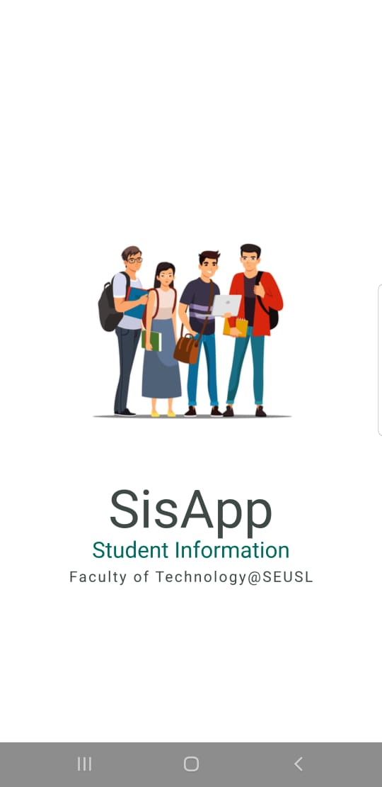
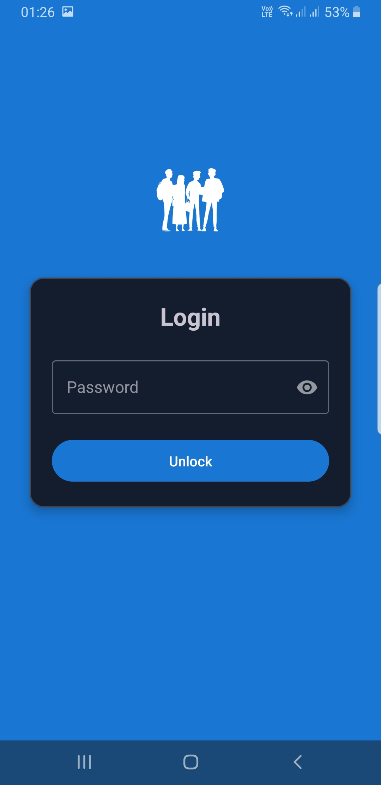
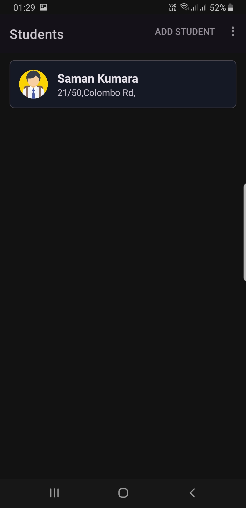
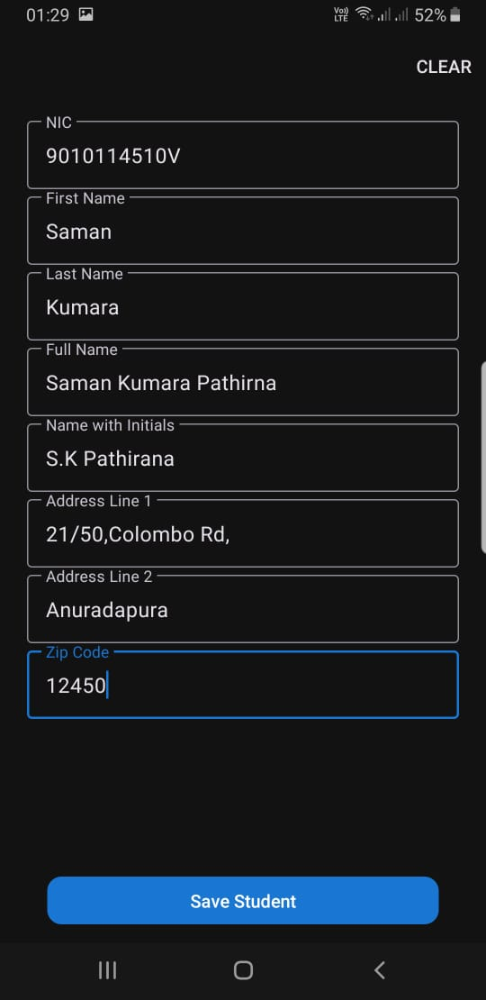
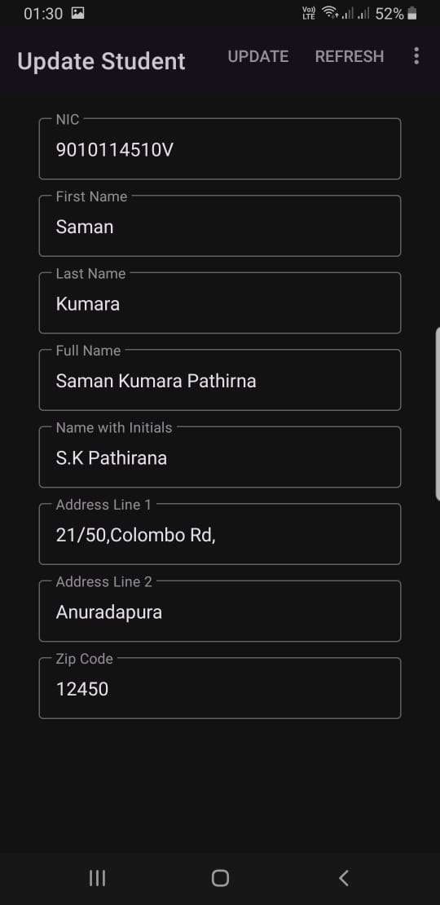

# SisApp - Student Information System

A modern Android application for managing student information with secure access and comprehensive CRUD operations. This application was developed as part of the Continuous Assessment for the Mobile Application Development subject.

## Academic Information
- **Subject**: Mobile Application Development
- **Project Type**: Continuous Assessment
- **Purpose**: Demonstrate practical implementation of Android development concepts

## Features

### 1. Security
- Secure login system with password protection
- Password change functionality
- Lock screen for application security

### 2. Student Management
- Create new student records
- View list of all students
- Update existing student information
- Comprehensive student details including:
  - NIC (National Identity Card) number
  - First Name
  - Last Name
  - Full Name
  - Name with Initials
  - Address (Line 1 and Line 2)
  - ZIP Code

### 3. User Interface
- Modern Material Design implementation
- Clean and intuitive user interface
- Splash screen with smooth transition
- Responsive layouts for different screen sizes
- Support for both light and dark themes
- RecyclerView for efficient list display

## Technical Stack

### Core Technology
- Language: Java
- Minimum SDK: 24 (Android 7.0)
- Target SDK: 35
- Compile SDK: 36

### Architecture & Components
- AndroidX libraries
- SQLite Database for local data storage
- Custom SQLiteOpenHelper implementation
- ViewBinding for efficient view handling

### Dependencies
- AndroidX AppCompat
- Material Design Components
- ConstraintLayout
- Activity
- Lifecycle Components (LiveData, ViewModel)
- Annotation Support Library

### Development Tools
- Gradle Build System (Kotlin DSL)
- ProGuard configuration for release builds
- JUnit for unit testing
- Espresso for UI testing

### Database Schema
The application uses a local SQLite database with the following structure:

```sql
Table: student
- id (INTEGER PRIMARY KEY AUTOINCREMENT)
- nic (TEXT)
- firstName (TEXT NOT NULL)
- lastName (TEXT NOT NULL)
- fullName (TEXT NOT NULL)
- nameWithInitials (TEXT NOT NULL)
- addressLineOne (TEXT NOT NULL)
- addressLineTwo (TEXT)
- zipCode (INTEGER NOT NULL)
```

## Build and Run

### Prerequisites
- Android Studio Arctic Fox or later
- JDK 11 or higher
- Android SDK with minimum API level 24

### Building the Project
1. Clone the repository
2. Open the project in Android Studio
3. Sync Gradle files
4. Build the project using the "Build" menu or Gradle tasks

### Running the Application
- Connect an Android device or use an emulator
- Click "Run" in Android Studio
- Select your target device
- Wait for the installation and launch

## Testing
- Unit tests available in the `test` directory
- Instrumented tests available in the `androidTest` directory
- Uses JUnit and Espresso testing frameworks

## Architecture
The application follows a traditional Android architecture with:
- Activities for UI and user interaction
- DBHelper for database operations
- Model classes for data structure
- Adapters for list handling
- Custom ViewHolders for efficient view recycling

## User Interfaces

<p align="center">
  
  
  
  <br>
  
  
</p>

## Contributing
Feel free to submit issues and enhancement requests.

## License
[Your License Here]

## Contact
[Your Contact Information]